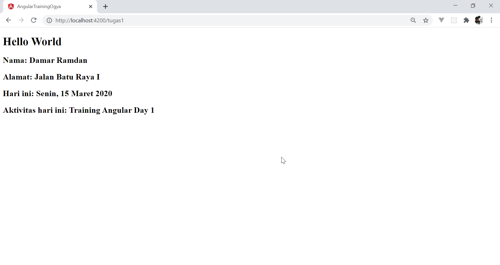

# Tugas Day 1

* Create new app (gunakan saja app yang dibuat tadi)
* Hapus semua isi di ``app.component.html`` kecuali ``<router-outlet></router-outlet>``
* Create new component, namakan ``Tugas1``
* Daftarkan component tsb ke ``route`` pada ``app-routing.module.ts`` dengan cara
```typescript
const routes: Routes = [{
  path: 'tugas1',
  component: Tugas1Component
}];
```
<i>jika ada error tidak masalah, routing module hanya meminta import component, lakukan import component</i>

* Pada ``tugas1.component.ts``, buatlah variabel ``firstName``, ``lastName``, ``address``, ``today`` dan ``activity``
* isikan variabel-variabel tersebut sesuka anda
* Sisipkan data-data tersebut pada template htmlnya dengan menggunakan <i>interpolation</i> sehingga memiliki tampilan seperti berikut 



## Selamat Mengerjakan~~